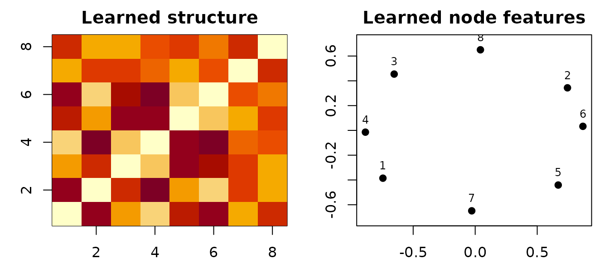

# Computing GW barycenters

A GW barycenter summarizes several weighted structures with a new,
fixed-size structure. An FGW barycenter can also summarize node
features. The inputs may contain different numbers of nodes because the
solver learns a coupling from each sample to the shared barycenter.

This vignette combines three related point-cloud shapes into an
eight-node template. You will obtain its structure matrix, feature
matrix, weights, and one coupling per input sample.

``` r

library(rfugw)
```

## What does each sample contain?

Each sample needs a square structure matrix `C` and a feature matrix `F`
with one row per node. Here, `C` contains normalized pairwise distances,
while `F` contains two measured attributes. All feature matrices must
have the same number of columns.

``` r

make_sample <- function(n, phase, seed) {
  set.seed(seed)
  angle <- seq(0, 2 * pi, length.out = n + 1)[-(n + 1)] + phase
  xy <- cbind(cos(angle), 0.7 * sin(angle))
  xy <- xy + matrix(rnorm(2 * n, sd = 0.04), ncol = 2)
  C <- as.matrix(dist(xy))
  C <- C / max(C)
  F <- cbind(horizontal = xy[, 1], vertical = xy[, 2])
  list(C = C, F = F)
}

samples <- list(
  make_sample(8, 0.00, 1),
  make_sample(10, 0.12, 2),
  make_sample(9, -0.10, 3)
)
Cs <- lapply(samples, `[[`, "C")
Ys <- lapply(samples, `[[`, "F")
```

``` r

data.frame(
  sample = seq_along(samples),
  nodes = vapply(Cs, nrow, integer(1)),
  features = vapply(Ys, ncol, integer(1))
)
#>   sample nodes features
#> 1      1     8        2
#> 2      2    10        2
#> 3      3     9        2
```

Structure and feature scales affect the optimization. In this example
the structures are scaled to `[0, 1]`; the default feature-cost
normalization also scales each cross-feature cost before solving.

## How do you fit an FGW barycenter?

[`fgw_barycenters()`](https://bbuchsbaum.github.io/rfugw/reference/fgw_barycenters.md)
alternates between FGW couplings and closed-form updates of the
barycenter. `N` sets the output size, not the size of any particular
sample.

``` r

bary <- fgw_barycenters(
  N = 8, Ys = Ys, Cs = Cs,
  alpha = 0.5, epsilon = 0.08,
  max_iter = 30L, tol = 1e-4, random_state = 42
)
```

``` r

data.frame(
  status = bary$status,
  converged = bary$converged,
  nodes = nrow(bary$C),
  features = ncol(bary$X),
  iterations = bary$iterations,
  final_update = bary$error,
  objective = bary$objective
)
#>      status converged nodes features iterations final_update  objective
#> 1 converged      TRUE     8        2         29 8.705077e-05 0.08389649
```

``` r

data.frame(
  sample = seq_along(bary$solver_diagnostics),
  status = vapply(bary$solver_diagnostics, `[[`, character(1), "status"),
  inner_status = vapply(
    bary$solver_diagnostics, `[[`, character(1), "inner_status"
  ),
  max_inner_residual = vapply(
    bary$solver_diagnostics, `[[`, numeric(1), "max_inner_residual"
  )
)
#>   sample    status inner_status max_inner_residual
#> 1      1 converged    converged       6.950018e-10
#> 2      2 converged    converged       9.098079e-10
#> 3      3 converged    converged       6.315681e-10
```

`bary$C` is the learned `8 x 8` structure and `bary$X` is the learned
`8 x 2` feature matrix. `error` is the final update magnitude, not a
proof of global optimality. Barycenter optimization is non-convex, so
inspect the history and consider multiple initializations when the
result matters.

The heat map below shows the learned pairwise structure; the feature
panel places the same eight barycenter nodes in their learned feature
coordinates.



The off-diagonal variation in `C` and the spread of `X` show that
neither learned component has collapsed to a constant.

## What do the couplings mean?

The `i`th coupling maps barycenter nodes (rows) to nodes of sample `i`
(columns). Its marginals reproduce the barycenter and sample weights.

``` r

data.frame(
  sample = seq_along(Cs),
  rows = vapply(bary$couplings, nrow, integer(1)),
  columns = vapply(bary$couplings, ncol, integer(1)),
  transported_mass = vapply(bary$couplings, sum, numeric(1))
)
#>   sample rows columns transported_mass
#> 1      1    8       8                1
#> 2      2    8      10                1
#> 3      3    8       9                1
```

Large entries identify strong correspondences, but
[`which.max()`](https://rdrr.io/r/base/which.min.html) is only a hard
summary of a soft coupling and can discard meaningful uncertainty.

## How does `alpha` change the problem?

`alpha` weights structure relative to features: `alpha = 0` is
feature-only and `alpha = 1` is structure-only. Values in between fit
both. Objective values from different `alpha` settings are not directly
comparable because they weight different losses.

``` r

mostly_features <- fgw_barycenters(
  8, Ys, Cs, alpha = 0.2, epsilon = 0.08,
  max_iter = 100L, tol = 1e-4, random_state = 42
)
mostly_structure <- fgw_barycenters(
  8, Ys, Cs, alpha = 0.8, epsilon = 0.08,
  max_iter = 100L, tol = 1e-4, random_state = 42
)
```

``` r

data.frame(
  alpha = c(0.2, 0.8),
  status = c(mostly_features$status, mostly_structure$status),
  final_update = c(mostly_features$error, mostly_structure$error)
)
#>   alpha    status final_update
#> 1   0.2 converged 8.300001e-05
#> 2   0.8 converged 9.865693e-05
```

``` r

data.frame(
  difference = c("structure matrices", "feature matrices"),
  relative_change = c(
    sqrt(sum((mostly_structure$C - mostly_features$C)^2)) /
      sqrt(sum(mostly_features$C^2)),
    sqrt(sum((mostly_structure$X - mostly_features$X)^2)) /
      sqrt(sum(mostly_features$X^2))
  )
)
#>           difference relative_change
#> 1 structure matrices       0.1773603
#> 2   feature matrices       0.8584568
```

Choose `alpha` from domain knowledge or a downstream validation
criterion, not from the smallest raw objective across settings.

## How do sample weights work?

`lambdas` controls how strongly each input contributes. The values are
normalized to sum to one. This is useful when samples have unequal
reliability; it is not a substitute for node weights `ps`, which act
within samples.

``` r

weighted <- fgw_barycenters(
  8, Ys, Cs, lambdas = c(0.6, 0.25, 0.15),
  alpha = 0.5, epsilon = 0.08,
  max_iter = 30L, tol = 1e-4, random_state = 42
)
```

## What if the support is already fixed?

That is an ordinary linear-Wasserstein problem, not a GW barycenter. If
every input already has a meaningful cross-cost to the same support and
only the support weights are unknown, use
[`ot_barycenter_weights()`](https://bbuchsbaum.github.io/rfugw/reference/ot_barycenter_weights.md).
The returned object contains one barycenter weight vector and one
component coupling per input; it does not learn coordinates, features,
or a structure matrix.

``` r

fixed_support <- c(-1, 0, 1)
fixed_cost <- outer(
  fixed_support, fixed_support,
  function(x, y) (x - y)^2
)
fixed_cost <- fixed_cost / max(fixed_cost)

linear_bary <- ot_barycenter_weights(
  costs = list(fixed_cost, fixed_cost),
  measures = list(c(0.2, 0.5, 0.3), c(0.4, 0.2, 0.4)),
  coefficients = c(0.6, 0.4),
  mode = "regularized",
  support_cost = fixed_cost,
  epsilon = 0.1,
  tol = 3e-6,
  sinkhorn_tol = 1e-9
)
data.frame(
  support = fixed_support,
  weight = linear_bary$weights
)
#>   support    weight
#> 1      -1 0.2706155
#> 2       0 0.3911061
#> 3       1 0.3382784
```

Regularized mode reports a semi-debiased product-reference-KL Sinkhorn
objective: weighted source-to-support terms minus half the support self
term. Source self terms are constant in the optimized weights and are
omitted explicitly. Exact mode instead minimizes the weighted sum of
unregularized transport costs through a joint LP; it requires the
suggested `lpSolve` package. Exact weights may be zero. Regularized
weights obey the reported `min_weight` numerical interior. Neither
objective should be compared as if it were the GW/FGW objective above.

## Which barycenter function should you use?

| Available information | Function | Returned result |
|----|----|----|
| Cross-costs to a fixed common support; optimize only its weights | [`ot_barycenter_weights()`](https://bbuchsbaum.github.io/rfugw/reference/ot_barycenter_weights.md) | Weight vector, component transports, objective and KKT certificates |
| Structure and node features | [`fgw_barycenters()`](https://bbuchsbaum.github.io/rfugw/reference/fgw_barycenters.md) | Full list with structure, features, couplings, and history |
| Structure only | [`entropic_gromov_barycenters()`](https://bbuchsbaum.github.io/rfugw/reference/entropic_gromov_barycenters.md) | Structure matrix by default; full list with `log = TRUE` |
| POT-style entropic FGW interface | [`entropic_fused_gromov_barycenters()`](https://bbuchsbaum.github.io/rfugw/reference/entropic_fused_gromov_barycenters.md) | List containing features and structure; adds diagnostics with `log = TRUE` |

You can hold one part of an FGW barycenter fixed: set
`fixed_structure = TRUE` with `init_C`, or `fixed_features = TRUE` with
`init_X`. Fixing a component changes the estimand and should reflect a
substantive modeling choice.

## Where should you go next?

- [`vignette("multiset-alignment")`](https://bbuchsbaum.github.io/rfugw/articles/multiset-alignment.md)
  aligns each sample to a shared fixed or learned template and provides
  projection helpers.
- [`vignette("solver-guide")`](https://bbuchsbaum.github.io/rfugw/articles/solver-guide.md)
  explains GW and FGW formulations and their diagnostics.
- See
  [`?fgw_barycenters`](https://bbuchsbaum.github.io/rfugw/reference/fgw_barycenters.md)
  for initialization, inner-solver, and precision controls.
